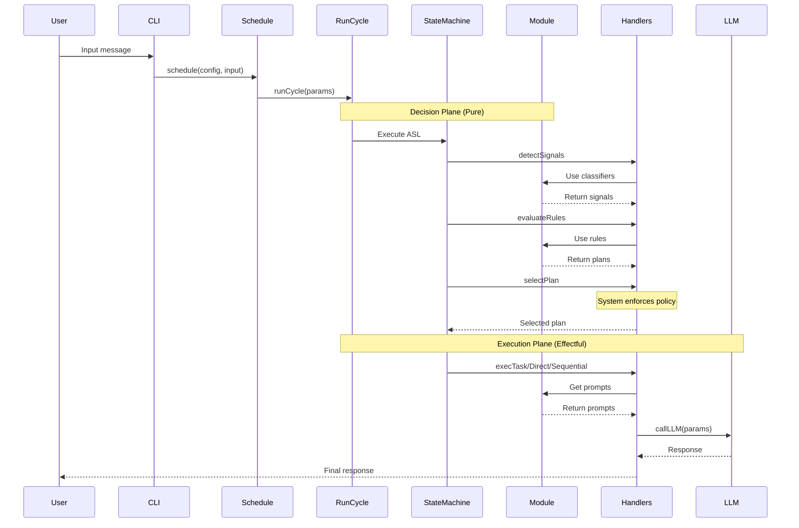
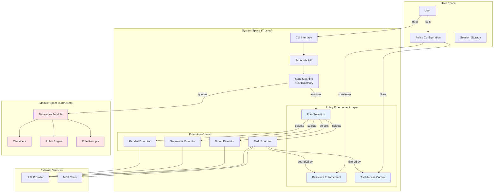
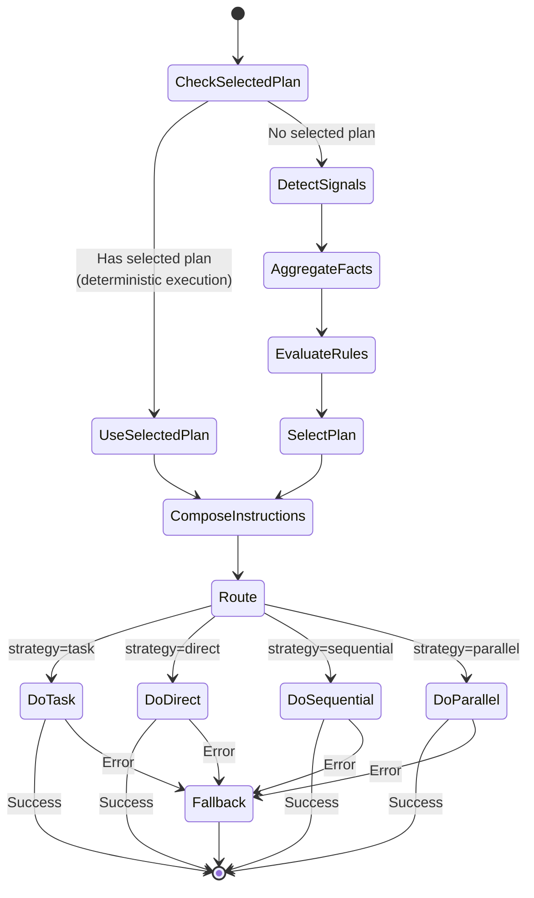
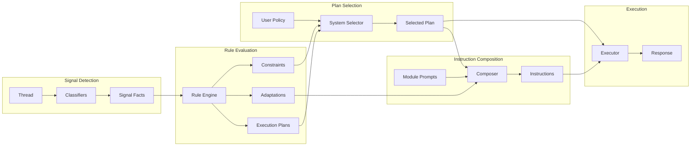
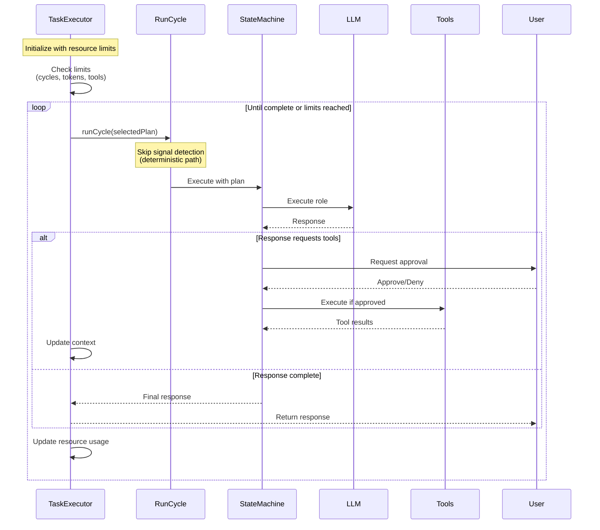

# ThinkSuit Architecture Overview

## System Purpose

ThinkSuit is an AI orchestration engine that converts conversation context into execution plans via a deterministic state machine, then executes those plans through LLM orchestration using pluggable behavioral modules.

## Core Architectural Principles

1. **Trust Boundaries**: System enforces user policy between untrusted modules and execution
2. **Two-Plane Architecture**: Pure decision plane, effectful execution plane
3. **Module-First Design**: Cognitive behavior defined by pluggable modules
4. **Policy Enforcement**: User constraints flow through system to bound module behavior

## High-Level Execution Flow

## Trust Boundaries and Component Architecture

## State Machine Flow

## Data Flow: Facts and Plans

## Task Execution Strategy (Meta-Orchestration)

## Key Architectural Patterns

### 1. Two-Plane Architecture
- **Decision Plane**: Pure functions for signal detection, rule evaluation, plan selection
- **Execution Plane**: Effectful handlers for LLM calls and tool execution

### 2. Policy Enforcement Points
- Plan selection (system overrides module suggestions)
- Resource limits (tokens, cycles, tool calls)
- Tool access (filtering based on user allowlist)
- Timeout enforcement

### 3. Module Isolation
- Modules provide cognitive behavior but don't control execution
- System mediates all module interactions with external resources
- Module decisions are suggestions, not commands

### 4. Session Continuity
- JSONL event streams capture full execution history
- Hierarchical time-based storage for efficient queries
- Sessions can be resumed, forked, and analyzed

## Security Considerations

1. **Untrusted Modules**: Modules are treated as untrusted third-party code
2. **Resource Bounds**: All execution has hard limits on resources
3. **Tool Approval**: User approval required for tool execution (configurable)
4. **Policy Override**: System can override module decisions based on user policy
5. **Audit Trail**: Complete trace logging for security analysis
