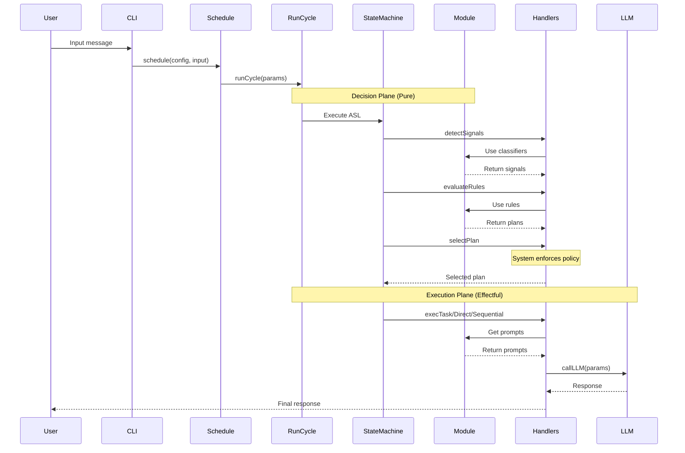
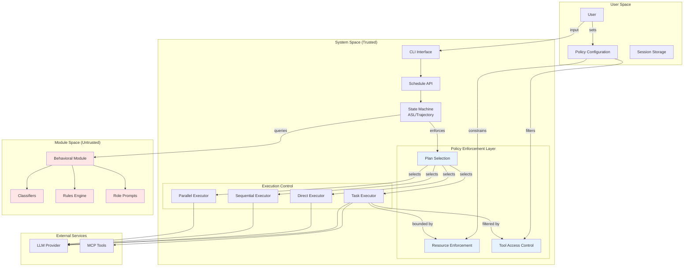
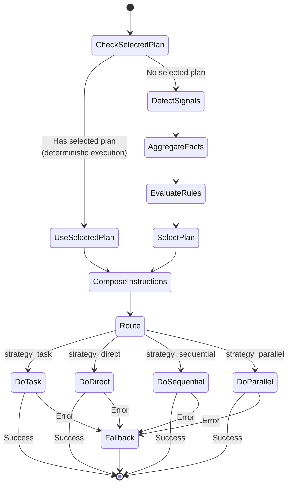
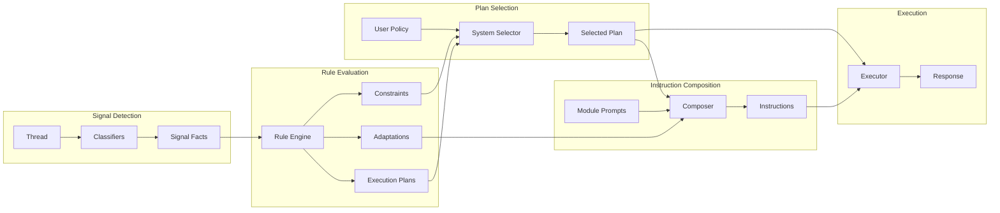
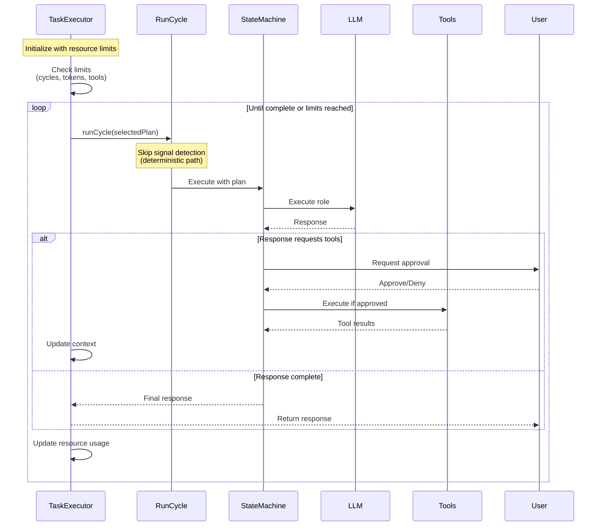

# ThinkSuit Architecture Overview

## System Purpose

ThinkSuit's core is an AI orchestration engine that converts conversation context into execution plans via a deterministic state machine, then executes those plans through LLM orchestration using pluggable behavioral modules.

That engine is the **kernel** of a larger goal — ThinkSuit as a personal operating system (see [vision.md](./vision.md)). This document covers what exists today: the package constellation and its interfaces (below), then the engine internals (execution flow, state machine, facts/plans). The aspirational layer is tracked in [roadmap.md](./roadmap.md).

## Core Architectural Principles

1. **Trust Boundaries**: System enforces user policy between untrusted modules and execution
2. **Two-Plane Architecture**: Pure decision plane, effectful execution plane
3. **Module-First Design**: Cognitive behavior defined by pluggable modules
4. **Policy Enforcement**: User constraints flow through system to bound module behavior

## Package Constellation & Interfaces

The repo is a monorepo of focused packages. The engine is the kernel; everything
else is a shell over it, a host around it, a behavior installed into it, or a
device it talks to. (OS metaphor is a lens — see [vision.md](./vision.md).)

```
                       shells / interfaces
        ┌─────────┬───────────┬──────────┬─────────┐
        │   cli   │  console  │  voice   │   tty   │
        └────┬────┴─────┬─────┴────┬─────┴────┬────┘
             └──────────┴────┬─────┴──────────┘
                             ▼
                     thinksuit-broker            process host / scheduler
                 worker-per-turn + control       (interrupt/approve/status/tail)
                             │ forks a worker per turn
                             ▼
                  thinksuit  (engine = kernel)   ──reads──►  ~/.thinksuit.json   (registry)
            signals → rules → plans → compose → execute      engine/secrets       (keyring)
                             │
              ┌──────────────┴───────────────┐
              ▼                               ▼
     thinksuit-modules                 thinksuit-mcp-tools
     (installed behaviors: mu)         (tools consumed INWARD by the agent)

     thinksuit-mcp-server ── exposes engine / sessions / signals OUTWARD ──► external MCP clients
```

| Package | Role (OS lens) | Responsibility | Key interface |
|---|---|---|---|
| `thinksuit` | kernel | Cognition pipeline + orchestration; config registry; secrets keyring; session routing | `schedule()`; `buildConfig`/`readUserConfig`/`patchUserConfig`; `resolveSecret`; `loadModules`; `subscribeToSession`/`getSessionStatus`/`getTrace`; `callLLM`. bin: `thinksuit-exec` |
| `thinksuit-modules` | installed behaviors | Cognitive roles, classifiers, rules, prompts; the `mu` module owns its `modalities`/`frames` | default export (the module map) |
| `thinksuit-broker` | process host / scheduler | Resident daemon; forks a worker per turn (`src/worker.js`); control channel; queue; per-session workspace provisioning | client export: `run`/`tail`/`interrupt`/`approve`/`status`/`log`/`awaitTurn`; `./broker` daemon; `./service` definition (managed by thinkctl) |
| `thinksuit-cli` | shell | Terminal REPL + one-shot runner | bin: `thinksuit` |
| `thinksuit-console` | shell (web) | SvelteKit UI: session inspection, run interface, wakeword studio, services control | `./service` definition (managed by thinkctl); no library export |
| `thinksuit-voice` | shell (voice front door) | Wake → capture → STT → turn → TTS; wakeword studio backend | exports `./devices` `./control` `./wakewords` `./session` `./recorder` `./training-worker` `./service`; bin `thinksuit-voice`; managed by thinkctl |
| `thinksuit-tty` | shell component | Terminal Svelte component + TTY WebSocket server | exports `./Terminal.svelte` `./server` `./service`; managed by thinkctl |
| `thinksuit-mcp-server` | devices (outward) | Exposes ThinkSuit to external MCP clients (Claude Desktop/IDEs) via tools `thinksuit`/`inspect`/`session`/`signals` | bin: `thinksuit-mcp-server` (stdio MCP) |
| `thinksuit-mcp-tools` | devices (inward) | Custom MCP tools consumed BY ThinkSuit (e.g. `roll_dice`) | bin: `thinksuit-mcp-tools` (stdio MCP) |
| `thinksuit-control` | operations control plane | Manages the LaunchAgent services (broker/console/tty/voice): discovers them from its own deps via each package's `./service` definition, generates plists in code, owns `launchctl` | bin: `thinkctl` (`up`/`down`/`start`/`stop`/`status`/`ls`/`logs`) |

> Note the two MCP packages point opposite directions: **mcp-server** exposes
> ThinkSuit *outward* as tools other agents can call; **mcp-tools** provides tools
> ThinkSuit calls *inward* during a turn.

### Key interfaces

- **Engine API — `schedule(turnRequest)`** (`thinksuit`): the primary entry point;
  the input is a **turnRequest** (`schemas/turnRequest.v1.json`) and the execution
  resolves to a **turnResult** (`schemas/turnResult.v1.json`). Returns
  `{ sessionId, scheduled, isNew, execution, ... }`. `run()` is internal — callers
  use `schedule()`.
- **Broker client** (`thinksuit-broker` default export): `run(config)` forks a
  worker for the turn and returns `{ sessionId, isNew, status }`;
  `tail(sessionId, onEntry)` streams the session log; `interrupt`/`approve`/
  `status`/`log`/`awaitTurn` are the control surface. Config is spread to the
  worker, so turn params (e.g. `modality`, `frame`) flow through unchanged.
- **Config contract**: durable settings live in `~/.thinksuit.json`, validated by
  `packages/thinksuit/schemas/userConfig.v1.json` (the per-turn request/result is a
  separate contract — `schemas/turnRequest.v1.json` / `turnResult.v1.json`).
  `readUserConfig`/`patchUserConfig`
  are sync, deep-merge helpers honoring a `THINKSUIT_CONFIG` override; `buildConfig`
  produces the layered (global ← project) run config.
- **Modality** (composition axis, sibling to frame): a turn param threaded
  `run/internals.js → runCycle.js → handlers/composeInstructions.js`; the module
  renders per-modality instruction text; `config.modality` is the default, `--modality`
  overrides, and the voice daemon asserts `'voice'`.
- **Service model**: every long-running package ships a `bin/service.mjs` and a
  self-describing `service.js` definition; `thinkctl` (`thinksuit-control`)
  discovers them from its deps and generates the launchd plist in code. See
  [SERVICE_MANAGEMENT.md](./SERVICE_MANAGEMENT.md).

## High-Level Execution Flow


```mermaid
sequenceDiagram
    participant User
    participant CLI
    participant Schedule
    participant RunCycle
    participant StateMachine
    participant Module
    participant Handlers
    participant LLM

    User->>CLI: Input message
    CLI->>Schedule: schedule(config, input)
    Schedule->>RunCycle: runCycle(params)

    Note over RunCycle,Module: Decision Plane (Pure)
    RunCycle->>StateMachine: Execute ASL
    StateMachine->>Handlers: detectSignals
    Handlers->>Module: Use classifiers
    Module-->>Handlers: Return signals
    StateMachine->>Handlers: evaluateRules
    Handlers->>Module: Use rules
    Module-->>Handlers: Return plans
    StateMachine->>Handlers: selectPlan
    Note over Handlers: System enforces policy
    Handlers-->>StateMachine: Selected plan

    Note over RunCycle,LLM: Execution Plane (Effectful)
    StateMachine->>Handlers: execTask/Direct/Sequential
    Handlers->>Module: Get prompts
    Module-->>Handlers: Return prompts
    Handlers->>LLM: callLLM(params)
    LLM-->>Handlers: Response
    Handlers-->>User: Final response
```

## Trust Boundaries and Component Architecture


```mermaid
graph TB
    subgraph "User Space"
        User[User]
        Policy[Policy Configuration]
        Sessions[Session Storage]
    end

    subgraph "System Space (Trusted)"
        CLI[CLI Interface]
        Schedule[Schedule API]
        SM[State Machine<br/>ASL/Trajectory]

        subgraph "Policy Enforcement Layer"
            PS[Plan Selection]
            RE[Resource Enforcement]
            TA[Tool Access Control]
        end

        subgraph "Execution Control"
            Task[Task Executor]
            Direct[Direct Executor]
            Seq[Sequential Executor]
            Para[Parallel Executor]
        end
    end

    subgraph "Module Space (Untrusted)"
        Module[Behavioral Module]
        Class[Classifiers]
        Rules[Rules Engine]
        Prompts[Role Prompts]
    end

    subgraph "External Services"
        LLM[LLM Provider]
        Tools[MCP Tools]
    end

    User -->|sets| Policy
    User -->|input| CLI
    Policy -->|constrains| RE
    Policy -->|filters| TA

    CLI --> Schedule
    Schedule --> SM
    SM -->|queries| Module
    Module --> Class
    Module --> Rules
    Module --> Prompts

    SM -->|enforces| PS
    PS -->|selects| Task
    PS -->|selects| Direct
    PS -->|selects| Seq
    PS -->|selects| Para

    Task -->|bounded by| RE
    Task -->|filtered by| TA
    Task --> LLM
    Task --> Tools

    Direct --> LLM
    Seq --> LLM
    Para --> LLM

    style Module fill:#ffe6e6
    style Class fill:#ffe6e6
    style Rules fill:#ffe6e6
    style Prompts fill:#ffe6e6
    style PS fill:#e6f3ff
    style RE fill:#e6f3ff
    style TA fill:#e6f3ff
```

## State Machine Flow


```mermaid
stateDiagram-v2
    [*] --> CheckSelectedPlan

    CheckSelectedPlan --> UseSelectedPlan: Has selected plan<br/>(deterministic execution)
    CheckSelectedPlan --> DetectSignals: No selected plan

    UseSelectedPlan --> ComposeInstructions

    DetectSignals --> AggregateFacts
    AggregateFacts --> EvaluateRules
    EvaluateRules --> SelectPlan
    SelectPlan --> ComposeInstructions

    ComposeInstructions --> Route

    Route --> DoTask: strategy=task
    Route --> DoDirect: strategy=direct
    Route --> DoSequential: strategy=sequential
    Route --> DoParallel: strategy=parallel

    DoTask --> [*]: Success
    DoDirect --> [*]: Success
    DoSequential --> [*]: Success
    DoParallel --> [*]: Success

    DoTask --> Fallback: Error
    DoDirect --> Fallback: Error
    DoSequential --> Fallback: Error
    DoParallel --> Fallback: Error

    Fallback --> [*]
```

## Data Flow: Facts and Plans


```mermaid
graph LR
    subgraph "Signal Detection"
        Thread[Thread] --> Classifiers
        Classifiers --> Signals[Signal Facts]
    end

    subgraph "Rule Evaluation"
        Signals --> Rules[Rule Engine]
        Rules --> Plans[Execution Plans]
        Rules --> Adaptations[Adaptations]
        Rules --> Constraints[Constraints]
    end

    subgraph "Plan Selection"
        Plans --> Selector[System Selector]
        Constraints --> Selector
        Policy[User Policy] --> Selector
        Selector --> Selected[Selected Plan]
    end

    subgraph "Instruction Composition"
        Selected --> Composer[Composer]
        Adaptations --> Composer
        Prompts[Module Prompts] --> Composer
        Composer --> Instructions[Instructions]
    end

    subgraph "Execution"
        Instructions --> Executor
        Selected --> Executor
        Executor --> Response
    end
```

## Task Execution Strategy (Meta-Orchestration)


```mermaid
sequenceDiagram
    participant TaskExecutor
    participant RunCycle
    participant StateMachine
    participant LLM
    participant Tools
    participant User

    Note over TaskExecutor: Initialize with resource limits
    TaskExecutor->>TaskExecutor: Check limits<br/>(cycles, tokens, tools)

    loop Until complete or limits reached
        TaskExecutor->>RunCycle: runCycle(selectedPlan)
        Note over RunCycle: Skip signal detection<br/>(deterministic path)
        RunCycle->>StateMachine: Execute with plan
        StateMachine->>LLM: Execute role
        LLM-->>StateMachine: Response

        alt Response requests tools
            StateMachine->>User: Request approval
            User-->>StateMachine: Approve/Deny
            StateMachine->>Tools: Execute if approved
            Tools-->>StateMachine: Tool results
            TaskExecutor->>TaskExecutor: Update context
        else Response complete
            StateMachine-->>TaskExecutor: Final response
            TaskExecutor-->>User: Return response
        end

        TaskExecutor->>TaskExecutor: Update resource usage
    end
```

## Key Architectural Patterns

### 1. Two-Plane Architecture
- **Decision Plane**: Pure functions for signal detection, rule evaluation, plan selection
- **Execution Plane**: Effectful handlers for LLM calls and tool execution

### 2. Policy Enforcement Points
- Plan selection (system overrides module suggestions)
- Resource limits (tokens, cycles, tool calls)
- Tool access (filtering based on user allowlist)
- Timeout enforcement

### 3. Module Isolation
- Modules provide cognitive behavior but don't control execution
- System mediates all module interactions with external resources
- Module decisions are suggestions, not commands

### 4. Session Continuity
- JSONL event streams capture full execution history
- Hierarchical time-based storage for efficient queries
- Sessions can be resumed, forked, and analyzed

## Security Considerations

1. **Untrusted Modules**: Modules are treated as untrusted third-party code
2. **Resource Bounds**: All execution has hard limits on resources
3. **Tool Approval**: User approval required for tool execution (configurable)
4. **Policy Override**: System can override module decisions based on user policy
5. **Audit Trail**: Complete trace logging for security analysis
