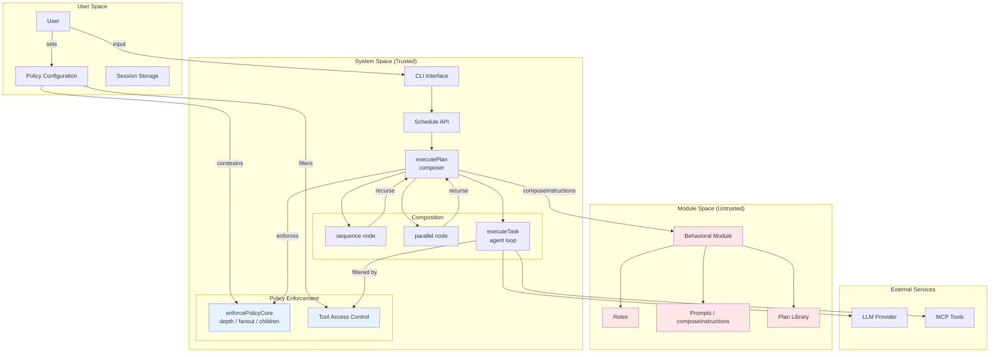
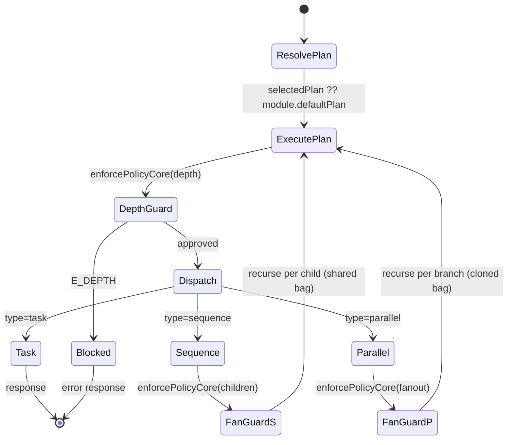
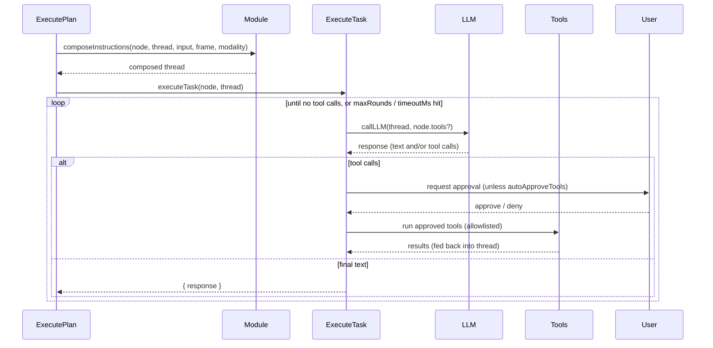

# ThinkSuit Architecture Overview

## System Purpose

ThinkSuit's core is an AI orchestration engine that runs **authored plans**: a turn resolves a
plan (a tree of `task`/`sequence`/`parallel` nodes), and the composer executes it through LLM
orchestration using pluggable behavioral modules. `task` is a round-bounded agent loop;
`sequence`/`parallel` compose those loops and thread results between them.

That engine is the **kernel** of a larger goal — ThinkSuit as a personal operating system (see [vision.md](./vision.md)). This document covers what exists today: the package constellation and its interfaces (below), then the engine internals (turn flow, the composer + loop, plans). The aspirational layer is tracked in [roadmap.md](./roadmap.md).

## Core Architectural Principles

1. **Trust Boundaries**: System enforces user policy between untrusted modules and execution
2. **Composition is structural**: the agent loop is the one effectful primitive; `sequence`/`parallel` compose it
3. **Module-First Design**: Cognitive behavior defined by pluggable modules
4. **Policy Enforcement**: User constraints flow through the composer to bound module behavior

## Package Constellation & Interfaces

The repo is a monorepo of focused packages. The engine is the kernel; everything
else is a shell over it, a host around it, a behavior installed into it, or a
device it talks to. (OS metaphor is a lens — see [vision.md](./vision.md).)

```
                       shells / interfaces
        ┌─────────┬───────────┬──────────┬─────────┐
        │   cli   │  console  │  voice   │   tty   │
        └────┬────┴─────┬─────┴────┬─────┴────┬────┘
             └──────────┴────┬─────┴──────────┘
                             ▼
                     thinksuit-broker            process host / scheduler
                 worker-per-turn + control       (interrupt/approve/status/tail)
                             │ forks a worker per turn
                             ▼
                  thinksuit  (engine = kernel)   ──reads──►  ~/.thinksuit.json   (registry)
           resolve plan → executePlan → executeTask         thinksuit-genai/env  (env keyring)
                             │
              ┌──────────────┴───────────────┐
              ▼                               ▼
     thinksuit-modules                 thinksuit-mcp-tools
     (installed behaviors: mu)         (tools consumed INWARD by the agent)

     thinksuit-mcp-server ── exposes engine / sessions / inspect OUTWARD ──► external MCP clients
```

| Package | Role (OS lens) | Responsibility | Key interface |
|---|---|---|---|
| `thinksuit` | kernel | Plan composer + agent loop; config registry; session routing | `schedule()`; `buildConfig`/`readUserConfig`/`patchUserConfig`; `resolveEnv`; `loadModules`; `subscribeToSession`/`getSessionStatus`/`getTrace`; `callLLM`. bin: `thinksuit-exec` |
| `thinksuit-modules` | installed behaviors | Cognitive roles, prompts, `composeInstructions`, and a plan library; the `mu` module owns its `modalities`/`frames` | default export (the module map) |
| `thinksuit-broker` | process host / scheduler | Resident daemon; forks a worker per turn (`src/worker.js`); control channel; queue; per-session workspace provisioning | client export: `run`/`tail`/`interrupt`/`approve`/`status`/`log`/`awaitTurn`; `./broker` daemon; `./service` definition (managed by thinkctl) |
| `thinksuit-cli` | shell | Terminal REPL + one-shot runner | bin: `thinksuit` |
| `thinksuit-console` | shell (web) | SvelteKit UI: session inspection, run interface, wakeword studio, services control | `./service` definition (managed by thinkctl); no library export |
| `thinksuit-voice` | shell (voice front door) | Wake → capture → STT → turn → TTS; wakeword studio backend | exports `./devices` `./control` `./wakewords` `./session` `./recorder` `./training-worker` `./service`; bin `thinksuit-voice`; managed by thinkctl |
| `thinksuit-tty` | shell component | Terminal Svelte component + TTY WebSocket server | exports `./Terminal.svelte` `./server` `./service`; managed by thinkctl |
| `thinksuit-mcp-server` | devices (outward) | Exposes ThinkSuit to external MCP clients (Claude Desktop/IDEs) via tools `thinksuit`/`inspect`/`session` | bin: `thinksuit-mcp-server` (stdio MCP) |
| `thinksuit-mcp-tools` | devices (inward) | Custom MCP tools consumed BY ThinkSuit (e.g. `roll_dice`) | bin: `thinksuit-mcp-tools` (stdio MCP) |
| `thinksuit-control` | operations control plane | Manages the LaunchAgent services (broker/console/tty/voice): discovers them from its own deps via each package's `./service` definition, generates plists in code, owns `launchctl` | bin: `thinkctl` (`up`/`down`/`start`/`stop`/`status`/`ls`/`logs`) |

> Note the two MCP packages point opposite directions: **mcp-server** exposes
> ThinkSuit *outward* as tools other agents can call; **mcp-tools** provides tools
> ThinkSuit calls *inward* during a turn.

### Key interfaces

- **Engine API — `schedule(turnRequest)`** (`thinksuit`): the primary entry point;
  the input is a **turnRequest** (`schemas/turnRequest.v1.json`) and the execution
  resolves to a **turnResult** (`schemas/turnResult.v1.json`). Returns
  `{ sessionId, scheduled, isNew, execution, ... }`. `run()` is internal — callers
  use `schedule()`.
- **Broker client** (`thinksuit-broker` default export): `run(config)` forks a
  worker for the turn and returns `{ sessionId, isNew, status }`;
  `tail(sessionId, onEntry)` streams the session log; `interrupt`/`approve`/
  `status`/`log`/`awaitTurn` are the control surface. Config is spread to the
  worker, so turn params (e.g. `modality`, `frame`) flow through unchanged.
- **Config contract**: durable settings live in `~/.thinksuit.json`, validated by
  `packages/thinksuit/schemas/userConfig.v1.json` (the per-turn request/result is a
  separate contract — `schemas/turnRequest.v1.json` / `turnResult.v1.json`).
  `readUserConfig`/`patchUserConfig`
  are sync, deep-merge helpers honoring a `THINKSUIT_CONFIG` override; `buildConfig`
  produces the layered (global ← project) run config.
- **Modality** (composition axis, sibling to frame): a turn param threaded
  `run/internals.js → executePlan → module.composeInstructions`; the module
  renders per-modality instruction text; `config.modality` is the default, `--modality`
  overrides, and the voice daemon asserts `'voice'`.
- **Service model**: every long-running package ships a `bin/service.mjs` and a
  self-describing `service.js` definition; `thinkctl` (`thinksuit-control`)
  discovers them from its deps and generates the launchd plist in code. See
  [SERVICE_MANAGEMENT.md](./SERVICE_MANAGEMENT.md).

## High-Level Execution Flow

```mermaid
sequenceDiagram
    participant User
    participant CLI
    participant Schedule
    participant ExecuteOnce
    participant ExecutePlan
    participant ExecuteTask
    participant Module
    participant LLM

    User->>CLI: Input message
    CLI->>Schedule: schedule(turnRequest)
    Schedule->>ExecuteOnce: run() → executeOnce()
    Note over ExecuteOnce: Resolve plan<br/>(selectedPlan ?? module.defaultPlan)
    ExecuteOnce->>ExecutePlan: executePlan(rootNode, ctx)

    Note over ExecutePlan: Enforce policy (depth); dispatch by node.type
    alt node is sequence/parallel
        ExecutePlan->>ExecutePlan: recurse per child<br/>(thread results via context bag)
    end

    ExecutePlan->>Module: composeInstructions(node, ...)
    Module-->>ExecutePlan: composed thread
    ExecutePlan->>ExecuteTask: run the task node (agent loop)

    loop until no tool calls or bound hit
        ExecuteTask->>LLM: callLLM(thread, tools?)
        LLM-->>ExecuteTask: response (text or tool calls)
        opt tool calls
            ExecuteTask->>User: request approval (unless auto)
            ExecuteTask->>ExecuteTask: run tool, feed result back
        end
    end
    ExecuteTask-->>ExecutePlan: { response }
    ExecutePlan-->>User: Final response
```

## Trust Boundaries and Component Architecture


```mermaid
graph TB
    subgraph "User Space"
        User[User]
        Policy[Policy Configuration]
        Sessions[Session Storage]
    end

    subgraph "System Space (Trusted)"
        CLI[CLI Interface]
        Schedule[Schedule API]
        Plan[executePlan<br/>composer]

        subgraph "Policy Enforcement"
            PE[enforcePolicyCore<br/>depth / fanout / children]
            TA[Tool Access Control]
        end

        subgraph "Composition"
            Seq[sequence node]
            Para[parallel node]
            Task[executeTask<br/>agent loop]
        end
    end

    subgraph "Module Space (Untrusted)"
        Module[Behavioral Module]
        Roles[Roles]
        Prompts[Prompts / composeInstructions]
        Plans[Plan Library]
    end

    subgraph "External Services"
        LLM[LLM Provider]
        Tools[MCP Tools]
    end

    User -->|sets| Policy
    User -->|input| CLI
    Policy -->|constrains| PE
    Policy -->|filters| TA

    CLI --> Schedule
    Schedule --> Plan
    Plan -->|composeInstructions| Module
    Module --> Roles
    Module --> Prompts
    Module --> Plans

    Plan -->|enforces| PE
    Plan --> Seq
    Plan --> Para
    Plan --> Task
    Seq -->|recurse| Plan
    Para -->|recurse| Plan

    Task -->|filtered by| TA
    Task --> LLM
    Task --> Tools

    style Module fill:#ffe6e6
    style Roles fill:#ffe6e6
    style Prompts fill:#ffe6e6
    style Plans fill:#ffe6e6
    style PE fill:#e6f3ff
    style TA fill:#e6f3ff
```

## Plan Shape (plan.v1 node tree)

A plan is an authored tree of nodes (schema: `packages/thinksuit/schemas/plan.v1.json`).
The file *is* the root node, with `name`/`description` inline:

```
Plan = { name, description?, ...Node }
Node =
  | { type:"task",     role, tools?, input?, id?, maxRounds?, timeoutMs?, params? }
  | { type:"sequence", children: Node[], resultStrategy?, id? }
  | { type:"parallel", children: Node[], resultStrategy?, id? }
```

- `params` is an open module-knob bag (`lengthLevel`, `adaptations`, `maxTokens`).
- `input` is a `$`-template (`$input`, `$last_response`, `$<id>_response`); omitted ⇒ prior
  result, else the turn input.
- `resultStrategy` (`last`/`concat`/`label`/`formatted`) combines child results.

## Plan Composition Flow


```mermaid
stateDiagram-v2
    [*] --> ResolvePlan
    ResolvePlan --> ExecutePlan: selectedPlan ?? module.defaultPlan

    ExecutePlan --> DepthGuard: enforcePolicyCore(depth)
    DepthGuard --> Dispatch: approved
    DepthGuard --> Blocked: E_DEPTH

    Dispatch --> Task: type=task
    Dispatch --> Sequence: type=sequence
    Dispatch --> Parallel: type=parallel

    Sequence --> FanGuardS: enforcePolicyCore(children)
    Parallel --> FanGuardP: enforcePolicyCore(fanout)
    FanGuardS --> ExecutePlan: recurse per child (shared bag)
    FanGuardP --> ExecutePlan: recurse per branch (cloned bag)

    Task --> [*]: response
    Blocked --> [*]: error response
```

## Task Node (the agent loop)


```mermaid
sequenceDiagram
    participant ExecutePlan
    participant Module
    participant ExecuteTask
    participant LLM
    participant Tools
    participant User

    ExecutePlan->>Module: composeInstructions(node, thread, input, frame, modality)
    Module-->>ExecutePlan: composed thread
    ExecutePlan->>ExecuteTask: executeTask(node, thread)

    loop until no tool calls, or maxRounds / timeoutMs hit
        ExecuteTask->>LLM: callLLM(thread, node.tools?)
        LLM-->>ExecuteTask: response (text and/or tool calls)
        alt tool calls
            ExecuteTask->>User: request approval (unless autoApproveTools)
            User-->>ExecuteTask: approve / deny
            ExecuteTask->>Tools: run approved tools (allowlisted)
            Tools-->>ExecuteTask: results (fed back into thread)
        else final text
            ExecuteTask-->>ExecutePlan: { response }
        end
    end
```

## Key Architectural Patterns

### 1. Composer + Loop
- **Composer** (`executePlan`): structural — dispatches nodes by `type`, recurses into
  composites, threads results between siblings via a context bag. No LLM calls of its own.
- **Agent loop** (`executeTask`): the one effectful primitive — LLM calls + tool execution.

### 2. Policy Enforcement Points
Limits are enforced by the numeric `enforcePolicyCore` at the three points in the composer
where the bounded runtime value actually exists:
- **Recursion depth** — checked at `executePlan` entry. Depth grows per descent
  (`childContext` increments it), so every node dispatch re-checks it.
- **Fanout** — checked in the `parallel` branch before spawning N branches.
- **Children** — checked in the `sequence` branch before running N steps.
- **Tool access** — `applyToolPolicy` filters discovered tools against the user
  allowlist at MCP discovery (`config.allowedTools`); `executeTask` also enforces the
  node's own `tools` allowlist per call.
- **Round/timeout budgets** — enforced inside `executeTask`'s loop (`maxRounds`/`timeoutMs`).

A block produces a normal error response (`policyBlocked`, code `E_DEPTH`/`E_FANOUT`/`E_CHILDREN`).

### 3. Module Isolation
- Modules provide cognitive behavior but don't control execution
- System mediates all module interactions with external resources
- Module decisions are suggestions, not commands

### 4. Session Continuity
- JSONL event streams capture full execution history
- Hierarchical time-based storage for efficient queries
- Sessions can be resumed, forked, and analyzed

## Security Considerations

1. **Untrusted Modules**: Modules are treated as untrusted third-party code
2. **Resource Bounds**: All execution has hard limits on resources
3. **Tool Approval**: User approval required for tool execution (configurable)
4. **Policy Override**: System can override module decisions based on user policy
5. **Audit Trail**: Complete trace logging for security analysis
6. **Secrets never enter logs**: Provider credentials live only in the genai
   service, which resolves them by name (`resolveEnv`, environment first then
   `~/.thinksuit/.env`); they never reach the engine, broker, or console
   processes and are never serialized into the session JSONL on disk.
