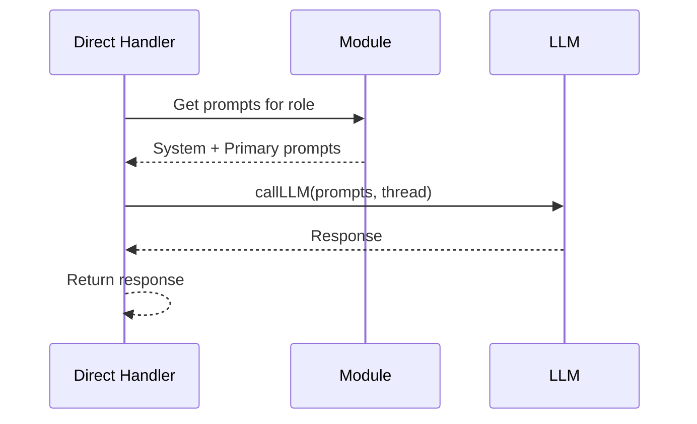
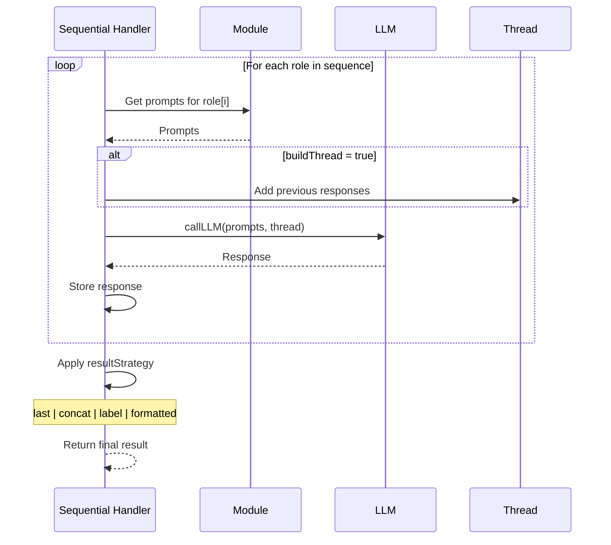
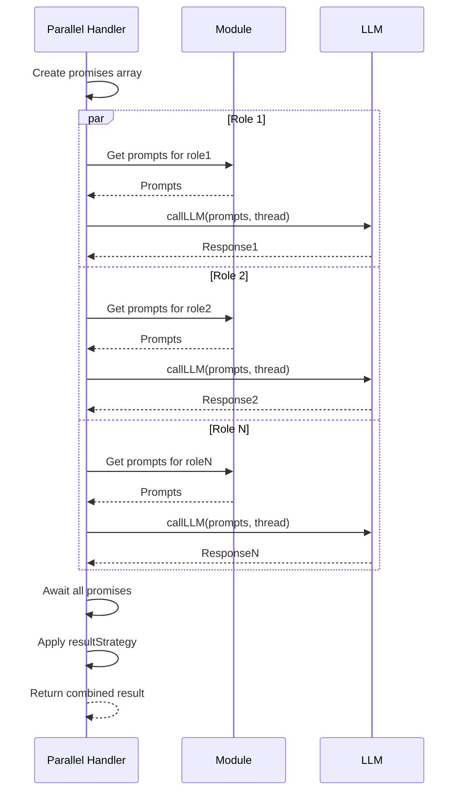
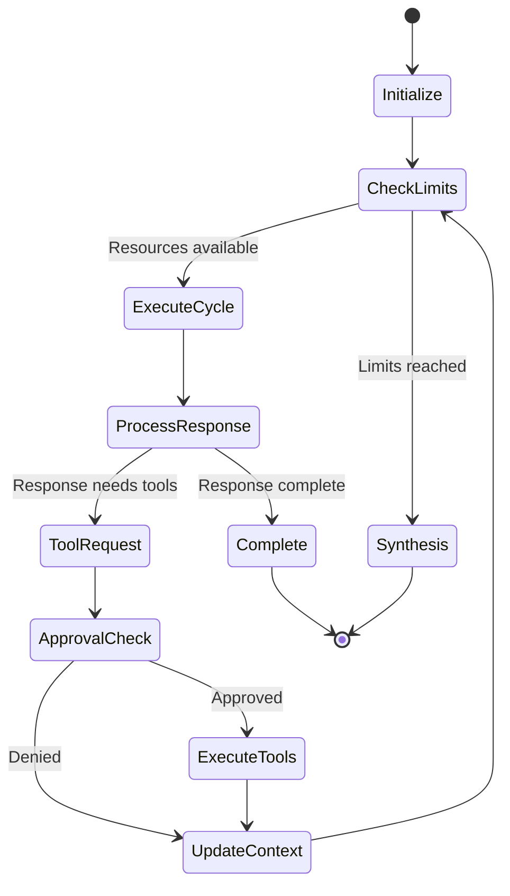
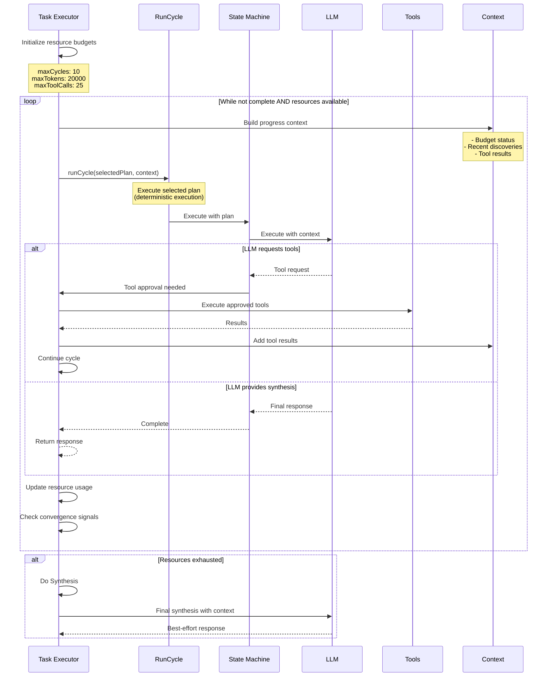
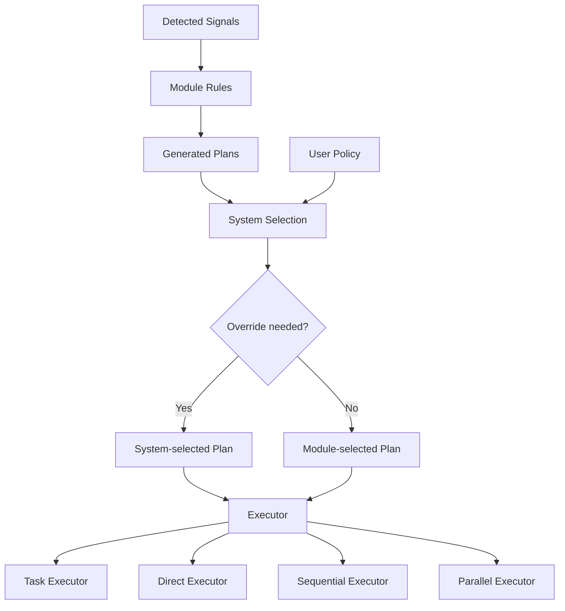

# ThinkSuit Execution Strategies

## Overview

ThinkSuit supports multiple execution strategies that determine how the system orchestrates responses. The strategy is selected by the rules engine based on signals detected in the conversation, then potentially overridden by system policy.

## Strategy Types

### Direct Execution

Single-pass execution with a specific role. The simplest strategy for straightforward responses.



**When Used:**
- Simple questions with clear intent
- No tool execution needed (can detect tool requests but not execute them)
- Single perspective sufficient

**Resource Usage:**
- 1 LLM call
- No recursion
- Minimal overhead

### Sequential Execution

Multi-step execution where roles execute in order, optionally building a conversation thread between steps.



**When Used:**
- Complex reasoning requiring multiple perspectives
- Analysis followed by synthesis
- Exploration followed by critique

**Configuration Options:**
- `buildThread`: Whether to accumulate responses
- `resultStrategy`: How to combine results
  - `last`: Return only final response
  - `concat`: Concatenate all responses
  - `label`: Label each response with role
  - `formatted`: Use module-specific formatter

### Parallel Execution

Multiple roles execute simultaneously and results are combined.



**When Used:**
- Need diverse perspectives simultaneously
- Time-sensitive responses
- Independent analyses that can be parallelized

**Benefits:**
- Lower latency than sequential
- Efficient for independent operations

### Task Execution (Meta-Orchestration)

Multi-cycle execution with tool usage and intelligent convergence. The most sophisticated strategy.



**Detailed Task Execution Flow:**



**When Used:**
- Complex tasks requiring investigation
- Tool usage needed for completion
- Multi-step workflows with approvals
- Default strategy for safety (handles all cases)

**Key Features:**
- Resource budget management
- Tool discovery and execution
- Progress tracking between cycles
- Natural convergence behavior
- Recursive orchestration with optimization

## Strategy Selection Process



## Resource Management

Each strategy has different resource implications:

| Strategy | LLM Calls | Max Tokens | Tool Access | Recursion |
|----------|-----------|------------|-------------|-----------|
| Direct | 1 | Plan-defined | Can detect but not execute | No |
| Sequential | N (# of steps) | Plan-defined × N | Via task strategy steps | No |
| Parallel | N (# of roles) | Plan-defined × N | Via task strategy branches | No |
| Task | 1-maxCycles | maxTokens total | Full execution | Yes |

## Configuration Examples

### Direct Execution Plan
```json
{
  "strategy": "direct",
  "role": "assistant",
  "maxTokens": 1000
}
```

### Sequential Execution Plan
```json
{
  "strategy": "sequential",
  "sequence": [
    { "role": "explorer", "strategy": "task" },
    { "role": "analyzer", "strategy": "direct" },
    { "role": "synthesizer", "strategy": "direct" }
  ],
  "tools": ["list_directory", "read_text_file", "read_media_file", "read_multiple_files"],
  "buildThread": true,
  "resultStrategy": "last",
  "maxTokens": 3000
}
```

**Note:** If a step is specified as just a string (e.g., `"explorer"`), it defaults to using 'task' strategy. Tools defined at the plan level are only passed to steps that use 'task' strategy.

### Parallel Execution Plan
```json
{
  "strategy": "parallel",
  "roles": [
    { "role": "explorer", "strategy": "task" },
    { "role": "critic", "strategy": "direct" }
  ],
  "tools": ["search_files", "read_text_file", "read_media_file", "read_multiple_files"],
  "resultStrategy": "label",
  "maxTokens": 2000
}
```

**Note:** Similar to sequential, branches can be strings (defaulting to 'task' strategy) or objects with explicit strategies.

### Task Execution Plan
```json
{
  "strategy": "task",
  "role": "assistant",
  "resolution": {
    "maxCycles": 10,
    "maxTokens": 20000,
    "maxToolCalls": 25,
    "timeoutMs": 180000
  },
  "tools": ["read_text_file", "read_media_file", "read_multiple_files", "write_file", "search_files"]
}
```

## Embedded Tool Usage in Orchestration

Sequential and Parallel strategies can embed tool-using steps by specifying 'task' as the step strategy:

### Example: Sequential with Tool-Using Explorer
```json
{
  "strategy": "sequential",
  "sequence": [
    { "role": "explorer", "strategy": "task" },  // Can use tools
    { "role": "analyzer", "strategy": "direct" }  // Cannot use tools
  ],
  "tools": ["list_directory", "read_text_file", "read_media_file", "read_multiple_files"],
  "buildThread": true
}
```

### Key Points:
- **Only execTask handles tool execution** - It's the sole executor for multi-cycle tool usage
- **Tools are conditionally passed** - Only steps with `strategy: "task"` receive tools
- **Default strategy is 'task'** - If not specified, steps default to task strategy
- **discoveredTools always passed** - Required infrastructure for tool execution

## Best Practices

1. **Use Task as Default**: Handles all cases safely, even simple ones
2. **Be Explicit About Strategies**: Use object notation to clearly specify step strategies
3. **Set Appropriate Limits**: Tune resource limits based on use case
4. **Consider Latency**: Parallel for speed, sequential for depth
5. **Monitor Convergence**: Task execution naturally converges as resources diminish
6. **Trust the System**: Policy enforcement ensures safety regardless of strategy
